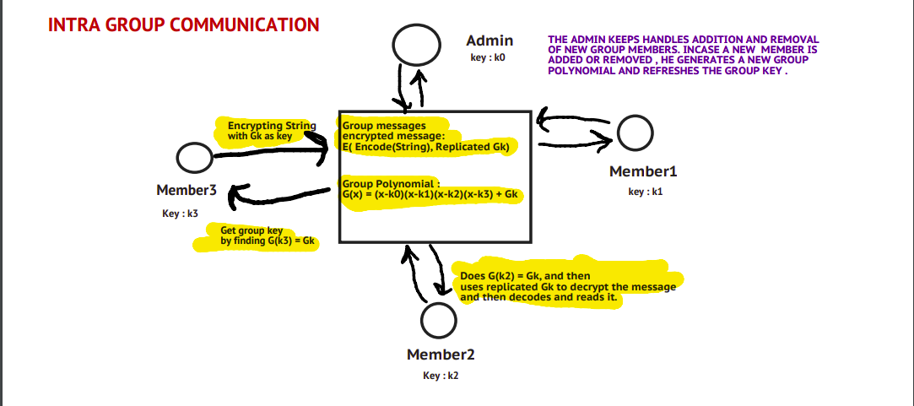
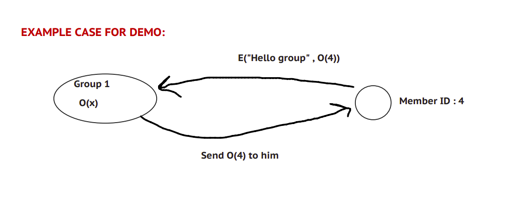

# Cryptography-Project
An Implementation of Polynomial Based Key Management for Secure Intra-Group and Inter-Group Communication

# Introduction

Group key management is a fundamental building block for secure group communication systems. The challenges are how to efficiently generate the secure key and re-keying without increasing the storage and communication overhead. There are various applications in which multicast traffic exists both within the same group and among different groups, such as conferences, hospitals, battlefields and offices. For example, consider an application related to a company that has several teams such as an audit team, development team, research team, personnel team and so on. If a member of the research team wants to send an inspection report to the audit team securely, it must be encrypted with a secret key. Only the audit team members will be able to recover the message from the sender. Also, if a member of the research team wants to share something with remaining members of the research team securely, he shall not want a member of any other team to be able to decrypt it. Enforcing security in these applications involves both intra-group and inter-group key management.

In order to communicate securely in the same group and among different groups, we shall employ a polynomial P to achieve efficient intra-group key refreshment and generate a polynomial H(x) to create an inter-group key. Such a mechanism reduces the number of re-keying messages during group membership changes, and also reduces the communication and key-storage overhead.

# Cryptographic Methods Used

## Encoding algorithm used:
Suppose you have a cipher text : "Attack", you would need to replace every letter with its ascii equivalent:

A : 1000001 (65) , t: 1110100 (116), t: 1110100 (116), a: 1100001 (97) , c: 1100011 (99), k: 1101011 (107)

Hence Attack is encoded as 100000111101001110100110000111000111101011

Now lets assume the key we are using is 1011010 , so we would have to replicate the key until equal to length
of encoded message

- Key : 1011010
- Replicated key : 1011010 1011010 1011010 1011010 1011010 1011010
- Encoded String : 1000001 1110100 1110100 1100001 1100011 1101011
- The encryption algorithm we have used across our project is the vernam cipher.
- 
Hence we shall now XOR the replicated string and encoded string bit by bit.
- Encrypted String : 001101101011100101110011101101110010110001 , We XOR with same key to decrypt.

## Note: In the following diagrams, Let encryption function be E(X,K) where X and K are binary strings and Encoding algorithm be Encode(String)

## Intra Group Communication Diagram 


## Intra Group Communication Example


## Inter Group Communication Diagram


## Inter Group Communication Example


# Running Instructions
```
pip install absl-py

python3 demo.py -l 127 -h 128
```
**-l** Flag is to specify the lower limit of the number of bit key that should be used in the simulation

**-h** Flag is to specify the upper limit of the number of bit key that should be used in the simulation
